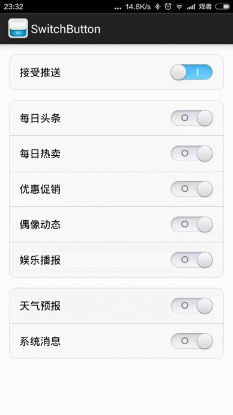

#  SwitchButton

SwitchButton是用在Android上的开关按钮，最低兼容Android2.1



###特性（Features）

>* 支持滑动切换

>* 支持标题

>* 支持Left、Top、Right、Bottom Drawable

>* 支持使用遮罩实现圆角按钮

###使用指南（Usage Guide）
####1. 导入SwitchButton（Import SwitchButton to your project）

#####使用Gradle（Use Gradle）
``从JCenter仓库导入（Import from jcenter）``

```groovy
dependencies{
	compile 'me.xiaopan:switchbutton:1.2.0'
}
```

``离线模式（Offline work）``

点击下载[switchbutton-1.2.0.aar](https://github.com/xiaopansky/SwitchButton/raw/master/releases/switchbutton-1.2.0.aar)，并放到你module的libs目录下

然后在你module的build.gradle文件中添加以下代码：
```groovy
repositories{
    flatDir(){
        dirs 'libs'
    }
}

dependencies{
    compile(name:'switchbutton-1.2.0.aar', ext:'aar')
}
```
最后同步一下Gradle即可

#####使用Eclipse（Use Eclipse）
请自行下载源码集成

####2. 配置最低版本（Configure min sdk version）
SwitchButton最低兼容API v7

#####使用Gradle（Use Gradle）
在app/build.gradle文件文件中配置最低版本为7
```groovy
android {
	...

    defaultConfig {
        minSdkVersion 7
        ...
    }
}
```

#####使用Eclipse（Use Eclipse）
在AndroidManifest.xml文件中配置最低版本为7
```xml
<manifest
	...
	>
    <uses-sdk android:minSdkVersion="7"/>
    <application>
    ...
    </application>
</manifest>
```

####3.准备图片

 switch_frame.png
 


switch_state_normal.png

 

switch_state_disable.png

 

switch_state_mask.png
 

switch_slider_normal.png

 

switch_slider_disable.png

 

selector_switch_state.xml
```xml
<?xml version="1.0" encoding="utf-8"?>
<selector xmlns:android="http://schemas.android.com/apk/res/android" >
    <item android:state_enabled="false" android:drawable="@drawable/switch_state_disable"/>
    <item android:drawable="@drawable/switch_state_normal"/>
</selector>
```

selector_switch_slider.xml
```xml
<?xml version="1.0" encoding="utf-8"?>
<selector xmlns:android="http://schemas.android.com/apk/res/android" >
    <item android:state_enabled="false" android:drawable="@drawable/switch_slider_disable"/>
    <item android:drawable="@drawable/switch_slider_normal"/>
</selector>
```

####4.在布局中使用SwitchButton并通过自定义属性设置图片
```xml
<?xml version="1.0" encoding="utf-8"?>
<me.xiaopan.switchbutton.SwitchButton
    xmlns:android="http://schemas.android.com/apk/res/android"
    xmlns:app="http://schemas.android.com/apk/res/me.xiaopan.android.switchbutton"
    android:id="@+id/switch"
    android:layout_width="match_parent"
    android:layout_height="wrap_content"
    android:minHeight="50dp"
    android:paddingLeft="30dp"
    android:paddingRight="30dp"
    android:text="接受推送"
    app:withTextInterval="16dp"
    app:frameDrawable="@drawable/switch_frame"
    app:stateDrawable="@drawable/selector_switch_state"
    app:stateMaskDrawable="@drawable/switch_state_mask"
    app:sliderDrawable="@drawable/selector_switch_slider"/>
```
属性解释
>* withTextInterval：标题文字和按钮之间的距离
>* frameDrawable：框架图片，定义按钮的大小以及显示区域
>* stateDrawable：状态图片，显示开启或关闭
>* stateMaskDrawable：状态图片遮罩层
>* sliderDrawable：滑块图片

其它方法：
>* setDrawables(Drawable frameBitmap, Drawable stateDrawable, Drawable stateMaskDrawable, Drawable sliderDrawable)：设置图片
>* setDrawableResIds(int frameDrawableResId, int stateDrawableResId, int stateMaskDrawableResId, int sliderDrawableResId)：设置图片ID
>* setWithTextInterval(int withTextInterval)：设置标题和按钮的间距，默认为16
>* setDuration(int duration)：设置动画持续时间，单位毫秒，默认为200
>* setMinChangeDistanceScale(float minChangeDistanceScale)：设置滑动有效距离比例，默认为0.2。例如按钮宽度为100，比例为0.2，那么只有当滑动距离大于等于(100*0.2)才会切换状态，否则就回滚

示例图片源码
```xml
<?xml version="1.0" encoding="utf-8"?>
<ScrollView
	xmlns:android="http://schemas.android.com/apk/res/android"
	xmlns:app="http://schemas.android.com/apk/res/me.xiaopan.android.switchbutton"
	android:layout_width="match_parent"
    android:layout_height="match_parent"
    android:background="@android:color/white">
	<LinearLayout
	    android:orientation="vertical"
	    android:layout_width="fill_parent"
	    android:layout_height="fill_parent"
	    android:paddingTop="16dp"
	    android:paddingBottom="16dp">

        <me.xiaopan.switchbutton.SwitchButton
	        style="@style/item"
            android:id="@+id/switch_main_1"
            android:text="接受推送"
            android:checked="true"
            android:background="@drawable/selector_preference_complete"
            app:withTextInterval="16dp"
            app:frameDrawable="@drawable/switch_frame"
            app:stateDrawable="@drawable/selector_switch_state"
            app:stateMaskDrawable="@drawable/switch_state_mask"
            app:sliderDrawable="@drawable/selector_switch_slider"/>

        <me.xiaopan.switchbutton.SwitchButton
	        style="@style/item"
            android:id="@+id/switch_main_2"
            android:text="每日头条"
	        android:background="@drawable/selector_preference_header"
	        android:layout_marginTop="16dp"
            app:withTextInterval="16dp"
            app:frameDrawable="@drawable/switch_frame"
            app:stateDrawable="@drawable/selector_switch_state"
            app:stateMaskDrawable="@drawable/switch_state_mask"
            app:sliderDrawable="@drawable/selector_switch_slider"/>

        <me.xiaopan.switchbutton.SwitchButton
            style="@style/item"
            android:id="@+id/switch_main_3"
            android:text="每日热卖"
            android:background="@drawable/selector_preference_center"
            app:withTextInterval="16dp"
            app:frameDrawable="@drawable/switch_frame"
            app:stateDrawable="@drawable/selector_switch_state"
            app:stateMaskDrawable="@drawable/switch_state_mask"
            app:sliderDrawable="@drawable/selector_switch_slider"/>

        <me.xiaopan.switchbutton.SwitchButton
            style="@style/item"
            android:id="@+id/switch_main_4"
            android:text="优惠促销"
            android:background="@drawable/selector_preference_center"
            app:withTextInterval="16dp"
            app:frameDrawable="@drawable/switch_frame"
            app:stateDrawable="@drawable/selector_switch_state"
            app:stateMaskDrawable="@drawable/switch_state_mask"
            app:sliderDrawable="@drawable/selector_switch_slider"/>

        <me.xiaopan.switchbutton.SwitchButton
	        style="@style/item"
            android:id="@+id/switch_main_5"
            android:text="偶像动态"
	        android:background="@drawable/selector_preference_center"
	        app:withTextInterval="16dp"
            app:frameDrawable="@drawable/switch_frame"
            app:stateDrawable="@drawable/selector_switch_state"
            app:stateMaskDrawable="@drawable/switch_state_mask"
            app:sliderDrawable="@drawable/selector_switch_slider"/>

		<me.xiaopan.switchbutton.SwitchButton
			style="@style/item"
			android:id="@+id/switch_main_6"
			android:text="娱乐播报"
			android:background="@drawable/selector_preference_footer"
			app:withTextInterval="16dp"
			app:frameDrawable="@drawable/switch_frame"
			app:stateDrawable="@drawable/selector_switch_state"
			app:stateMaskDrawable="@drawable/switch_state_mask"
			app:sliderDrawable="@drawable/selector_switch_slider"/>

        <me.xiaopan.switchbutton.SwitchButton
            style="@style/item"
            android:id="@+id/switch_main_7"
            android:text="天气预报"
            android:background="@drawable/selector_preference_header"
            android:layout_marginTop="16dp"
            app:withTextInterval="16dp"
            app:frameDrawable="@drawable/switch_frame"
            app:stateDrawable="@drawable/selector_switch_state"
            app:stateMaskDrawable="@drawable/switch_state_mask"
            app:sliderDrawable="@drawable/selector_switch_slider"/>

        <me.xiaopan.switchbutton.SwitchButton
            style="@style/item"
            android:id="@+id/switch_main_8"
            android:text="系统消息"
            android:background="@drawable/selector_preference_footer"
            app:withTextInterval="16dp"
            app:frameDrawable="@drawable/switch_frame"
            app:stateDrawable="@drawable/selector_switch_state"
            app:stateMaskDrawable="@drawable/switch_state_mask"
            app:sliderDrawable="@drawable/selector_switch_slider"/>
	</LinearLayout>
</ScrollView>

```

##License
```java
/*
 * Copyright (C) 2013 Peng fei Pan <sky@xiaopan.me>
 * 
 * Licensed under the Apache License, Version 2.0 (the "License");
 * you may not use this file except in compliance with the License.
 * You may obtain a copy of the License at
 * 
 *   http://www.apache.org/licenses/LICENSE-2.0
 * 
 * Unless required by applicable law or agreed to in writing, software
 * distributed under the License is distributed on an "AS IS" BASIS,
 * WITHOUT WARRANTIES OR CONDITIONS OF ANY KIND, either express or implied.
 * See the License for the specific language governing permissions and
 * limitations under the License.
 */
```
